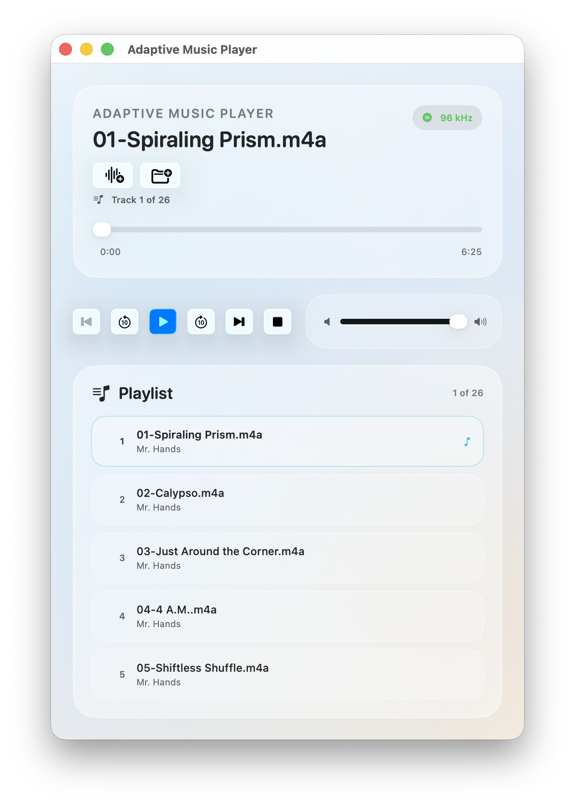

# Adaptive Music Player

Adaptive Music Player is a macOS audio player focused on sample-rate-aware playback. It loads local audio files, displays both file and hardware sample rates, and attempts to switch the system output rate to match the file for bit-perfect playback when possible.

Download the current release: [Latest release](https://github.com/sschwandter/AdaptiveMusicPlayer/releases/latest)



## What It Does

- Plays local audio files with `AVAudioPlayer`
- Shows playback progress, volume, and transport controls
- Displays file sample rate and current hardware sample rate
- Attempts automatic hardware sample-rate switching through Core Audio
- Exposes keyboard shortcuts for open, play/pause, stop, and skipping

## Current Structure

The project is organized by feature area under `Playback/`, with a small app shell under `App/`.

### App Layer

- `AdaptiveMusicPlayerApp.swift`
  Creates the main `WindowGroup` and installs app commands.
- `PlaybackCommands.swift`
  Defines menu items and keyboard shortcuts and dispatches them to the focused player scene.
- `PlaybackCommandActions.swift`
  Defines the focused-value bridge used to expose window-local playback actions from `ContentView` to the app command layer.

### Playback Domain

- `PlaybackState.swift`
  Defines the playback state enum, `AudioInfo`, and typed `PlaybackError` values.

### Playback Coordination

- `AudioPlaybackEngine.swift`
  Owns the underlying `AVAudioPlayer`, coordinates use cases, and is the main stateful playback coordinator.
- `AudioPlayer.swift`
  Acts as the `@Observable` view model used by SwiftUI. It exposes UI-facing playback state, status/error text, and owns asynchronous file-load orchestration for the view.

### Services

- `AudioFileLoader.swift`
  Handles security-scoped file loading.
- `AudioSessionManager.swift`
  Creates `AVAudioPlayer` sessions and performs initial sample-rate configuration.
- `PlaybackProgressTracker.swift`
  Tracks playback progress and finish events.
- `SampleRateManager.swift`
  Wraps Core Audio sample-rate queries and changes.

### Use Cases

- `LoadFileUseCase.swift`
- `PlaybackControlUseCase.swift`
- `SeekingUseCase.swift`
- `SyncSampleRateUseCase.swift`

These files hold smaller units of playback behavior, but the codebase is not a strict clean-architecture implementation. The engine and view model still contain important orchestration logic.

### UI

- `ContentView.swift`
  Main player interface. It binds to `AudioPlayer`, presents the file importer, and publishes focused command actions for the active window.

### Utilities

- `TimeFormatter.swift`
  Formats playback times for display.

## Build And Run

1. Open `AdaptiveMusicPlayer.xcodeproj` in Xcode.
2. Select the `AdaptiveMusicPlayer` scheme.
3. Build and run the app on macOS.

## Command Flow

Keyboard shortcuts and menu commands are defined at the app layer and routed through SwiftUI focused values. The active `ContentView` publishes a `PlaybackCommandActions` value, `PlaybackCommands` reads that focused value, and the selected action calls into `AudioPlayer`, which then drives `AudioPlaybackEngine`.

This keeps command routing window-scoped instead of broadcasting process-wide actions.

## File Loading Flow

`ContentView` does not manipulate loading state directly anymore. It asks `AudioPlayer` to load the selected file, and the view model immediately moves into loading state, optionally waits a short time for the file importer to dismiss, and then performs the asynchronous load through the engine.

That means the UI-facing contract for file loading now lives in one place instead of being split across the view and view model.

## Sample Rate Behavior

When playback starts, the app compares the file sample rate with the current hardware sample rate. If they already match, playback starts without requesting a hardware change. If they differ, the app tries to switch the default output device to the file sample rate before playback continues. If that fails, playback still proceeds and the UI shows that the hardware and file rates differ.

The UI uses:

- Green indicator when hardware and file sample rates are effectively aligned
- Orange indicator when playback is likely being resampled
- A manual sync button when a mismatch is detected

## Supported Formats

The app relies on system audio support through `AVAudioPlayer` / Core Audio. In practice, that includes common formats such as:

- MP3
- WAV
- AIFF
- AAC / M4A
- Other formats supported by the current macOS audio stack

## Tests

Tests live in:

- `AdaptiveMusicPlayerTests`
- `AdaptiveMusicPlayerUITests`

The unit tests currently cover:

- Basic `AudioPlayer` behavior
- `PlaybackControlUseCase`
- `PlaybackProgressTracker`
- `SampleRateManager` helper logic
- `TimeFormatter`

Run unit tests with:

```sh
xcodebuild test -scheme AdaptiveMusicPlayer -destination 'platform=macOS' -only-testing:AdaptiveMusicPlayerTests
```

UI tests exist, but command-line execution may depend on the local environment and permissions available to the test runner.

## Requirements

- macOS
- Xcode with current macOS SDK support

The project currently targets modern macOS SDKs configured in the Xcode project.

## Contributing

Please read [CONTRIBUTING.md](CONTRIBUTING.md) before opening a pull request.

## Security

Please read [SECURITY.md](SECURITY.md) for how to report security issues.

## License

This project is licensed under the MIT License. See [LICENSE](LICENSE).

## Notes

- The codebase aims for clear separation of concerns, but playback coordination and UI-facing state are still shared across the engine, the view model, and a small amount of view-local state.
- The README is intended to describe the code as it exists today, not an idealized future architecture.
